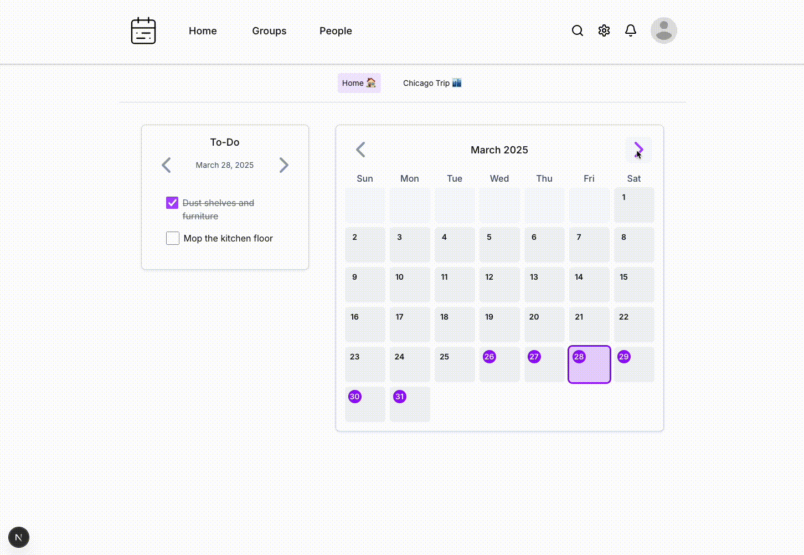

# Do & Due

### Rayvant Sahni, Israel Anjorin, Lance Kennedy, Suzanne Alexander, Beatrice Brown-Mulry

## Sprint 4 Tasks to Complete

1. Make events repeatable with different time frequencies (daily, weekly, monthly etc.)
2. Add the UI and backend routes necessary so users can edit details and members in their groups
3. Implement a model or modify the existing Events model to allow users to divide costs between members of a household
4. _pending_

## Testing Deployment Instructions

Clone the repository and `cd` into it.

### Backend

1. `cd` into the `backend/` directory
2. Use `pip install -r requirements.txt` to install backend dependencies (we recommend setting up a virtual environment for python package isolation)
3. Apply DB migrations with `python manage.py makemigrations` and `python manage.py migrate`
4. Finally, run the backend server with `python manage.py runserver`

### Frontend

1. `cd` into the `frontend/` directory
2. Use `npm install` to install dependencies
3. Finally, run the frontend server with `npm run dev`

### Running the Unit Tests
- run the command `python -m pytest --cov=chore_tracker --cov-report=html`
- navigate to  `/htmlcov/index.html` to see the coverage

## Demo

